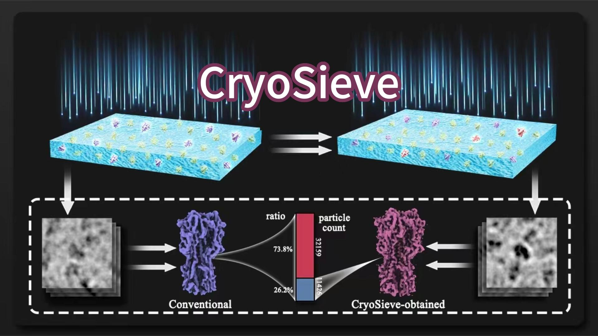

# CryoSieve Overview

CryoSieve is an advanced software solution designed for particle sorting/sieving in single particle analysis (SPA) for Cryogenic Electron Microscopy (cryo-EM). Supported by extensive experimental results, CryoSieve has demonstrated superior performance and efficiency compared to other cryo-EM particle sorting algorithms.

Its unique ability to eliminate unnecessary particles from final stacks significantly optimizes the data analysis process. The refined selection of particles that remain contribute to a notably higher resolution output in reconstructed density maps.

For certain datasets, the precision of CryoSieve's particle subset selection is so refined that it approaches the theoretical limit, delivering unprecedented detail and accuracy.

## Video Tutorial

A video tutorial is available within this repository. You can directly download it [here](cryosieve_video_tutorial.mp4).

We also provide [a JoVE paper](https://www.jove.com/t/66617/enhancing-density-maps-removing-majority-particles-single-particle) in the format of case studies, which includes video instructions on how to use CryoSieve.

## Publications

For more details, please refer to the paper ["A minority of final stacks yields superior amplitude in single-particle cryo-EM"](https://www.nature.com/articles/s41467-023-43555-x). If you find that CryoSieve contributes to your work, we kindly request you to cite this paper.

## The List of Available Demo Cases

| dataset | number of particles | molecular weight (kDa) | EMPIAR link | expected result link
| ------- | ------------------- | --------------------- | ----------- | --------------- |
| TRPA1 | 43,585 | 688 | [EMPIAR-10024](https://www.ebi.ac.uk/empiar/EMPIAR-10024/) | [link](https://github.com/mxhulab/cryosieve-demos/tree/master/EMPIAR-10024) |
| hemagglutinin | 130,000 | 150 | [EMPIAR-10097](https://www.ebi.ac.uk/empiar/EMPIAR-10097/) | [link](https://github.com/mxhulab/cryosieve-demos/tree/master/EMPIAR-10097) |
| LAT1 | 250,712 | 172 | [EMPIAR-10264](https://www.ebi.ac.uk/empiar/EMPIAR-10264/) | [link](https://github.com/mxhulab/cryosieve-demos/tree/master/EMPIAR-10264) |
| pfCRT | 16,905 | 102 | [EMPIAR-10330](https://www.ebi.ac.uk/empiar/EMPIAR-10330/) | [link](https://github.com/mxhulab/cryosieve-demos/tree/master/EMPIAR-10330) |
| TSHR-Gs | 41,054 | 125 | [EMPIAR-11120](https://www.ebi.ac.uk/empiar/EMPIAR-11120/) | [link](https://github.com/mxhulab/cryosieve-demos/tree/master/EMPIAR-11120) |
| TRPM8 | 42,040 | 513 | [EMPIAR-11233](https://www.ebi.ac.uk/empiar/EMPIAR-11233/) | [link](https://github.com/mxhulab/cryosieve-demos/tree/master/EMPIAR-11233) |
| apoferritin | 382,391 | 440 | [EMPIAR-10200](https://www.ebi.ac.uk/empiar/EMPIAR-10200/) | [link](https://github.com/mxhulab/cryosieve-demos/tree/master/EMPIAR-10200) |
| streptavidin | 23,991 | 52 | [EMPIAR-10269](https://www.ebi.ac.uk/empiar/EMPIAR-10269/)  | [link](https://github.com/mxhulab/cryosieve-demos/tree/master/EMPIAR-10269) |


# Installation

CryoSieve is an open-source software, developed using Python, and is available as a Python package. Please access our source code [on GitHub](https://github.com/mxhulab/cryosieve).

## Prerequisites

- Python version 3.7 or later.
- NVIDIA CUDA library 10.2 or later installed in the user's environment.

## Dependencies

The CryoSieve package depends on the following libraries:

```
numpy>=1.18
mrcfile>=1.2
starfile>=0.4.1,<0.5
pandans<2.2
cupy>=10
torch>=1.10
```

## Preparation of CUDA Environment

We recommend installing CuPy and PyTorch initially, as their installation largely depends on the CUDA environment. Please note, PyTorch should be CUDA-capable. To streamline this process, we suggest preparing a conda environment with the following commands.

For CUDA version <= 11.7:
```
conda create -n CRYOSIEVE_ENV python=3.8 cudatoolkit=10.2 cupy=10.0 pytorch=1.10 -c pytorch -c conda-forge
```
Please note that this command is tailored for CUDA version 10.2. To accommodate a different CUDA version, adjust the `cudatoolkit` version accordingly. Modify the versions of Python, [CuPy](https://cupy.dev), and [PyTorch](https://pytorch.org) based on requirements, ensuring compatibility with the minimal requirements of CryoSieve.

For CUDA version >= 11.8:
```
conda create -n CRYOSIEVE_ENV python=3.10 cupy=12.0 pytorch pytorch-cuda=12.1 -c pytorch -c nvidia -c conda-forge
```
Please note that this command is tailored for CUDA environment version 12.1. For a different CUDA version, adjust `pytorch-cuda` version accordingly.

## Installing CryoSieve

After preparing CuPy and PyTorch, it is crucial to activate it before proceeding with the CryoSieve installation.
```
conda activate CRYOSIEVE_ENV
```

Then, we turn to the step of installing CryoSieve. CryoSieve can be installed either via `pip` or `conda`.

To install CryoSieve using `pip`, execute the following command:
```
pip install cryosieve
```
Alternatively, to install CryoSieve using `conda`, execute the following command:
```
conda install -c mxhulab cryosieve
```

## Verifying Installation

You can verify whether CryoSieve has been installed successfully by running the following command:
```
cryosieve -h
```
This should display the help information for CryoSieve, indicating a successful installation.

# Tutorial

## Quickstart: A Toy Example

To validate your successful installation of CryoSieve and familiarize yourself with its functionalities, we highly recommend trying CryoSieve on this [toy example](https://github.com/mxhulab/cryosieve-demos/tree/master/toy). Please follow the steps below:

1. Download the dataset and place it into any directory of your choice, e.g., `~/toy/`.
2. Navigate to this directory by executing the following command:
```
cd ~/toy/
```
3. Initiate CryoSieve with the following command:
```
cryosieve-core --i CNG.star --o my_CNG_1.star --angpix 1.32 --volume CNG_A.mrc --volume CNG_B.mrc --mask CNG_mask.mrc --retention_ratio 0.8 --frequency 40
```
You may find explanation for each option of `cryosieve-core` [in the following section](#cryosieve-core).

When the `--num_gpus` parameter is used with a value larger than 1, CryoSieve's core program will leverage multiple GPUs to expedite the sieving process. It accomplishes this by using PyTorch's [elastic launch](https://pytorch.org/docs/1.10/elastic/run.html?highlight=torchrun) feature to initiate multiple processes. Each of these processes will use exactly one GPU.

For instance, on a machine equipped with 4 GPUs, you can use the following command to run the toy example:
```
cryosieve-core --i CNG.star --o my_CNG_1.star --angpix 1.32 --volume CNG_A.mrc --volume CNG_B.mrc --mask CNG_mask.mrc --retention_ratio 0.8 --frequency 40 --num_gpus 4
```

Upon successful execution, the command will generate two star files, `my_CNG_1.star` and `my_CNG_1_sieved.star`. These files contain the information of the remaining particles and the sieved particles, respectively. You can compare them with the provided `CNG_1.star` and `CNG_1_sieved.star` files. If executed correctly, they should contain the same particles.

## Processing Real-World Dataset

In this section, we provide a hands-on example of how to utilize CryoSieve for processing the final stack in a real-world experimental dataset.

### Download the Dataset

For this tutorial, we'll be using the final particle stack from the [EMPIAR-11233](https://www.ebi.ac.uk/empiar/EMPIAR-11233/) dataset. This dataset includes a final particle stack of TRPM8 bound to calcium, collected on a 300 kV FEI Titan Krios microscope.

To download the final particle stack, navigate to your desired working directory and execute the following command:

```
wget -nH -m -c ftp://ftp.ebi.ac.uk/empiar/world_availability/11233/data/Final_Particle_Stack/
```

Upon completion, you'll find a new directory named `XXX/data/Final_Particle_Stack` in your working directory. This directory contains a star file with all particle information and an mrcs file representing the final stack.

Additionally, you'll need a mask file. You can generate a mask file using any cryo-EM software, based on the reconstructed volume. If you prefer not to generate a mask file, we've provided one used in our experiments which you can download from this [link](https://github.com/mxhulab/cryosieve-demos/tree/master/EMPIAR-11233). Once you have the mask file, move it into the `Final_Particle_Stack` directory.

You can find additional demonstration data, along with expected results, in [this repository](https://github.com/mxhulab/cryosieve-demos/tree/master).

### Iterative Reconstruction and Sieving

To achieve optimal results with real-world datasets, the sieving process generally involves several iterations. In each iteration, we perform 3D reconstruction (and perhaps postprocessing to derive the Fourier Shell Correlation (FSC) curve and resolution). We then apply CryoSieve to sieve a fraction of the particles based on the reconstructed map. The highpass cut-off frequency typically increases with each round.

For your convenience, we've developed an automatic command `cryosieve` which performs all these steps in a single run. To use it, please follow these steps:

1. Change the working directory to `XXX/data/Final_Particle_Stack`:
```
cd XXX/data/Final_Particle_Stack
```
2. Our automatic program currently uses Relion for 3D reconstruction and postprocessing. Therefore, make sure that `relion_reconstruct` or `relion_reconstruct_mpi` and `relion_postprocess` are accessible. Once confirmed, run the following command:
```
cryosieve --reconstruct_software relion_reconstruct --postprocess_software relion_postprocess --i diver2019_pmTRPM8_calcium_Krios_6Feb18_finalParticleStack_EMPIAR_composite.star --o output/ --mask mask.mrc --angpix 1.059 --num_iters 10 --frequency_start 40 --frequency_end 3 --retention_ratio 0.8 --sym C4
```

For a detailed explanation of each `cryosieve` option, please refer to the following section [Options/Arguments of `cryosieve`](#cryosieve).

The entire process may take over an hour, depending on your system resources. Multiple result files will be generated and saved in the `output/` directory. For instance, the `_iter{n}.star` file contains particles that remain after the n-th sieving iteration, and the `_postprocess_iter{n}` folder houses the postprocessing result after the n-th iteration.

### [Recommended] Re-estimate poses

The objective of re-estimating poses is to prevent the unintentional transfer of information from the discarded particles to those that are retained. This process of re-estimating poses with CryoSPARC can be performed manually or automated using a Python module. We provide a Python script named `cryosieve-csrefine` in this repository for this purpose.

For manually re-estimating poses with CryoSPARC, particles must be imported using CryoSPARC’s `import particle stack` job. This importation is from the `_iter{n}.star` file, which contains particles remaining after the n-th sieving iteration. Subsequently, the process involves conducting sequential `ab-initio` jobs, followed by either `homogeneous refinement` or `non-uniform refinement` jobs.

Alternatively, users can utilize the `cryosieve-csrefine` command, available in this repository, to streamline the labor-intensive manual operations in CryoSPARC. This script automates the sequential execution of `import particle stack`, `ab-initio`, `homogenous refinement` or `non-uniform refinement` jobs for each input particle stack. Additionally, it generates a summary of resolutions and B-factors. For a detailed explanation of each option available in `cryosieve-csrefine`, please refer to the following section [Options/Arguments of `cryosieve-csrefine`](#cryosieve-csrefine).

### [Optional] Calculate the Rosenthal-Henderson B-factor

The gold standard for assessing the quality of a set of single particle images involves determining its Rosenthal-Henderson B-factor. A lower B-factor indicates better quality. Utilizing CryoSieve to filter out ineffective particles can reduce the B-factor, suggesting improved quality among the remaining particles. Users can leverage the `cryosieve-csrhbfactor` command to automatically calculate the Rosenthal-Henderson B-factor by CryoSPARC. The script's arguments/options are similar to those in `cryosieve-csrhbfactor`. For a detailed explanation of each `cryosieve-csrhbfactor` option, please refer to the following section [Options/Arguments of `cryosieve-csrhbfactor`](#cryosieve-csrhbfactor).

# Options/Arguments

<a name="cryosieve-core"></a>
## Options/Arguments of `cryosieve-core`

The program `cryosieve-core` is the core particle sieving module.

```
$ cryosieve-core -h
usage: cryosieve-core [-h] --i I --o O [--directory DIRECTORY] [--angpix ANGPIX] --volume VOLUME [--mask MASK]
                      --retention_ratio RETENTION_RATIO --frequency FREQUENCY [--num_gpus NUM_GPUS]

CryoSieve core.

options:
  -h, --help            show this help message and exit
  --i I                 input star file path.
  --o O                 output star file path.
  --directory DIRECTORY
                        directory of particles, empty (current directory) by default.
  --angpix ANGPIX       pixelsize in Angstrom.
  --volume VOLUME       list of volume file paths.
  --mask MASK           mask file path.
  --retention_ratio RETENTION_RATIO
                        fraction of retained particles, 0.8 by default.
  --frequency FREQUENCY
                        cut-off highpass frequency.
  --num_gpus NUM_GPUS   number of GPUs to execute the cryosieve program, 1 by default.
```

<a name="cryosieve"></a>
## Options/Arguments of `cryosieve`

The program `cryosieve` is an integreted program iteratively calling RELION and `cryosieve-core` to do sieving process.

```
$ cryosieve -h
usage: cryosieve [-h] --reconstruct_software RECONSTRUCT_SOFTWARE [--postprocess_software POSTPROCESS_SOFTWARE] --i I --o O --angpix ANGPIX [--sym SYM]
                 [--num_iters NUM_ITERS] [--frequency_start FREQUENCY_START] [--frequency_end FREQUENCY_END] [--retention_ratio RETENTION_RATIO] --mask MASK
                 [--balance] [--num_gpus NUM_GPUS]

CryoSieve: a particle sorting and sieving software for single particle analysis in cryo-EM.

options:
  -h, --help            show this help message and exit
  --reconstruct_software RECONSTRUCT_SOFTWARE
                        command for reconstruction.
  --postprocess_software POSTPROCESS_SOFTWARE
                        command for postprocessing.
  --i I                 input star file path.
  --o O                 output path prefix.
  --angpix ANGPIX       pixelsize in Angstrom.
  --sym SYM             molecular symmetry, C1 by default.
  --num_iters NUM_ITERS
                        number of iterations for applying CryoSieve, 10 by default.
  --frequency_start FREQUENCY_START
                        starting threshold frquency, in Angstrom, 50A by default.
  --frequency_end FREQUENCY_END
                        ending threshold frquency, in Angstrom, 3A by default.
  --retention_ratio RETENTION_RATIO
                        fraction of retained particles in each iteration, 0.8 by default.
  --mask MASK           mask file path.
  --balance             make remaining particles in different subsets in same size.
  --num_gpus NUM_GPUS   number of gpus to execute CryoSieve core program, 1 by default.
```

There are several useful remarks:

- CryoSieve utilizes the `RECONSTRUCT_SOFTWARE` in its reconstruction command. This enables you to enhance the speed of the reconstruction step through multiprocessing by using the option `--reconstruct_software "mpirun -n 5 relion_reconstruct_mpi"`. Additionally, you can further boost the reconstruction speed by using the option `--reconstruct_software "mpirun -n 5 relion_reconstruct_mpi --j 20"`, leveraging multi-threading.
- If `POSTPROCESS_SOFTWARE` is not given, CryoSieve will skip the postprocessing step. Notice that postprocessing is not necessary for the sieving procedure.
- Since `relion_reconstruct` use current directory as its default working directory, user should ensure that `relion_reconstruct` can correctly access the particles.

<a name="cryosieve-csrefine"></a>
## Options/Arguments of `cryosieve-csrefine`

The program `cryosieve-csrefine` is designed to automatically and sequentially execute a series of operations in CryoSPARC, namely `import particle stack`, `ab-initio`, `homogenous refinement` or `non-uniform refinement` jobs.

```
$ cryosieve-csrefine -h
usage: cryosieve-csrefine [-h] [--i I [I ...]] [--directory DIRECTORY] [--o O] [--sym SYM] [--ref REF]
                          [--ini_high INI_HIGH] [--repeat REPEAT] --user USER --project PROJECT --workspace WORKSPACE
                          --lane LANE [--nu] [--local] [--resplit] [--workers WORKERS]
                          [--min_angular_step MIN_ANGULAR_STEP]

cryosieve-csrefine: automatic SPA 3D-refinement by calling CryoSPARC.

options:
  -h, --help            show this help message and exit
  --i I [I ...]         input star file(s) or txt file(s) containing a list of star files.
  --directory DIRECTORY
                        directory of particles, empty (current directory) by default.
  --o O                 output summary csv file path. If not provided, no summary is written.
  --sym SYM             molecular symmetry, C1 by default.
  --ref REF             initial reference model. If not provided, CryoSPARC's ab-initio job will be used.
  --ini_high INI_HIGH   initial resolution.
  --repeat REPEAT       number of trials, 1 by default.
  --user USER           e-mail address of the user of CryoSPARC.
  --project PROJECT     project UID in CryoSPARC.
  --workspace WORKSPACE
                        workspace UID in CryoSPARC.
  --lane LANE           lane selected for computing in CryoSPARC.
  --nu                  use non-uniform refinement.
  --local               use local refinement after homogeneous / non-uniform refinement.
  --min_angular_step MIN_ANGULAR_STEP
                        minimum angular step for local refinement.
  --resplit             force re-do GS split.
  --workers WORKERS     number of workers to run CryoSPARC job, unlimited by default.
```

There are several useful remarks:

- The input parameter `--i` supports multiple star files, such as `--i a.star b.star c.star`. Wildcards can also be used, for example, `--i output/_iter?.star` will include `output/_iter0.star`, `output/_iter1.star` up to `output/_iter9.star` in the previous example. Additionally, the input file can be a `.txt` file containing star files, with each file listed on a separate line.
- When the `--o` parameter is provided, a summary report including resolutions and B-factors estimated by CryoSPARC will be written to a file in CSV format.
- This program submits a series of jobs within a designated project and workspace. The compute resources are determined by the lane parameter. By default, the program refines all star files in parallel, but the option `--workers` allows you to limit the number of jobs executing simultaneously.

For example, in the previous EMPAIR-11233 case, you can re-estimated all its output star files with a single command:
```
cryosieve-csrefine --i output/_iter?.star --o summary.csv --sym C4 --user XXX_YOUR_USER_EMAIL_XXX --project P1 --workspace W1 --lane XXX_YOUR_LANE_XXX
```

<a name="cryosieve-csrhbfactor"></a>
## Options/Arguments of `cryosieve-csrhbfactor`

The program `cryosieve-csrhbfactor` is designed to automatically determine Rosenthal-Henderson B-factor by calling `cryosieve-csrefine`.

```
$ cryosieve-csrhbfactor -h
usage: cryosieve-csrhbfactor [-h] [--i I [I ...]] [--directory DIRECTORY] --o O [--sym SYM] [--ref REF]
                             [--ini_high INI_HIGH] [--voltage VOLTAGE] [--repeat REPEAT] [--halves HALVES] --user USER
                             --project PROJECT --workspace WORKSPACE --lane LANE [--nu] [--resplit]
                             [--workers WORKERS]

cryosieve-csrhbfactor: automatic Rosenthal-Henderson B-factor estimation by calling CryoSPARC.

options:
  -h, --help            show this help message and exit
  --i I [I ...]         input star file(s) or txt file(s) containing a list of star files.
  --directory DIRECTORY
                        directory of particles, empty (current directory) by default.
  --o O                 output summary csv file path.
  --sym SYM             molecular symmetry, C1 by default.
  --ref REF             initial reference model. If not provided, CryoSPARC's ab-initio job will be used.
  --ini_high INI_HIGH   initial resolution.
  --voltage VOLTAGE     acceleration voltage (kV), 300 by default. Only 200 and 300 supported!
  --repeat REPEAT       number of trials, 1 by default.
  --halves HALVES       number of times executing halvings, 4 by default.
  --user USER           e-mail address of the user of CryoSPARC.
  --project PROJECT     project UID in CryoSPARC.
  --workspace WORKSPACE
                        workspace UID in CryoSPARC.
  --lane LANE           lane selected for computing in CryoSPARC.
  --nu                  use non-uniform refinement.
  --resplit             force re-do GS split.
  --workers WORKERS     number of workers to run CryoSPARC job, unlimited by default.
```

There are several useful remarks:

- The `cryosieve-csrhbfactor` program shares most parameters with `cryosieve-csrefine`, and their usage is similar.
- Estimating the Rosenthal-Henderson B-factor involves a computationally intensive process. It requires iteratively halving the particle dataset and estimating the resolutions for each subset. For example, if you want to estimate the Rosenthal-Henderson B-factors for all 10 output stacks from the previous demo, and you choose to perform 3 trials with each stack using up to 4th halves, it would involve a total of 10 * 3 * (4 + 1) = 150 rounds of 3D-refinement.

# Release Note

* Version 1.2.8:
  - Fix some bugs and improve performance.
  - Add several arguments in `cryosieve-csrefine` and `cryosieve-csrhbfactor`.
* Version 1.2.5:
  - Add two new programs: `cryosieve-csrefine` and `cryosieve-csrhbfactor`.
  - Introduce a simplified command for preparing the Conda environment.
  - Add support for CUDA >=11.8.
* Version 1.2.4:
  - Fix the bug occurring with starfile >=0.5. CryoSieve now requires starfile >=0.4, <0.5.
  - Support gloo backend for multi-GPU version of cryosieve-core.
  - Fix the bug of SequentialSampler occurring with pytorch >=2.
* Version 1.2.3: Add new video tutorial.
* Version 1.2.1: fix the bug occurring when multiple optic groups are present in a star file.
* Version 1.2: Initial stable release.

# FAQ

- Q: I successfully executed CryoSieve, but when I tried to import the sieve particles into CryoSPARC to re-estimate their poses, I encountered an error. How can I resolve this?
- A: When setting up the `import stack` job in CryoSPARC, ensure that the `particle_data_path` option is correctly configured.

- Q: Using the default parameters of CryoSieve, the resolution of the density map reconstructed from pose-restimated retained particles began to deteriorate from the first iteration of CryoSieve. What adjustments should I make?
- A: The first option of `cryosieve` that should be customized is `--retention_ratio`. Try increasing or decreasing it. The second option to adjust is `--frequency_end`. Use the resolution obtained from your dataset and try varying around that value.

- Q: When I run CryoSieve, I encountered an error like `mkl-service + Intel(R) MKL: MKL_THREADING_LAYER=INTEL is incompatible with libgomp.so.1 library`. How can I fix it?
- A: It seems there is a conflict between two threading methods (GNU_THREADING and MKL_THREADING) in your system, as they are not compatible with each other. Please try executing the following command before running CryoSieve:
  ```
  export MKL_THREADING_LAYER=GNU
  ```

- Q: When I run CryoSieve, it reports a warning like `setting OMP_NUM_THREADS environment variable for each process to be l in default, to avoid your system being overloaded, please further tune the variable for optimal performance in your application as needed.`
- A: To address this warning and prevent potential system overload, please try executing the following command before running CryoSieve:
  ```
  export OMP_NUM_THREADS=1
  ```
